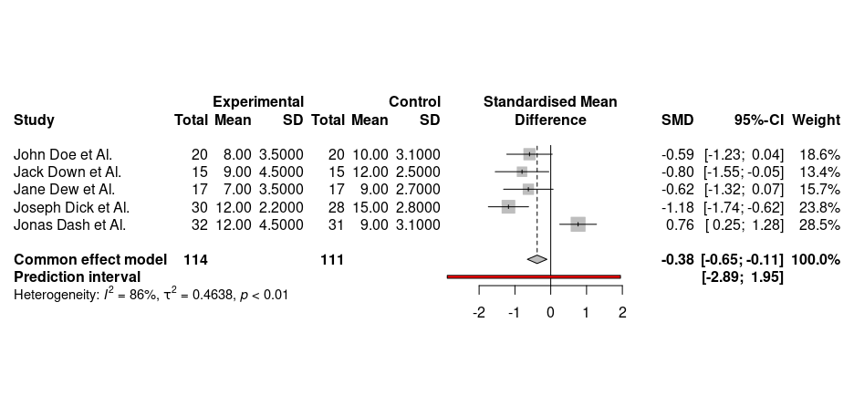
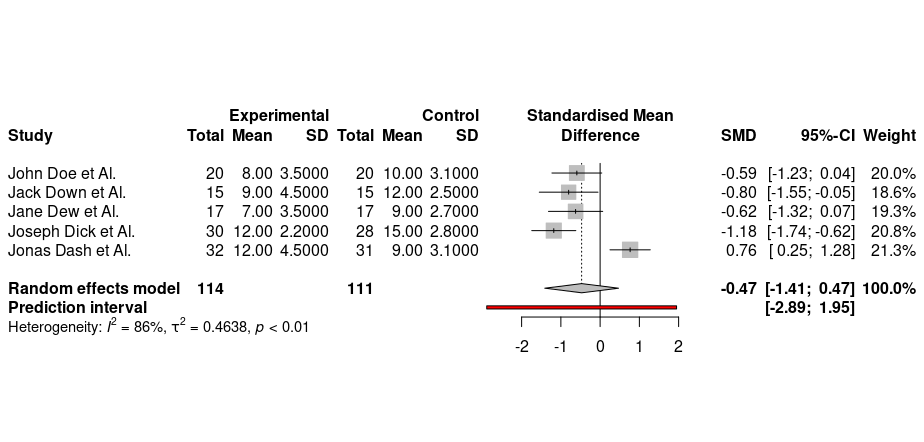

# Qué es un Metanálisis
Como definición podemos decir que 

> El metaanálisis es un método sistemático para sintetizar resultados de diferentes estudios empíricos sobre el efecto de una variable independiente, sea de intervención o tratamiento, en un resultado final preciso.

 *Metaanálisis: una forma básica de entender e interpretar su evidencia*,  Vicente Javier Escrig Sosa et Al

# Ejemplo

Imaginemos que queremos conocer si el uso de un medicamento reduce los días de hospitalización en pacientes de una enfermedad.  

Acudimos a la bibliografía y encontramos 5 estudios en los que se han realizado ensayos clínicos donde se miden las medias y desviaciones típicas de dias de hospitalización de un grupo experimental y placebo correspondiente a cada estudio.

Tomamos nota de los datos y elaboramos la siguente tabla

# Ejemplo

|estudio|tamaño experimental|media hospitalización experimental| $\sigma$ hospitalización experimental|tamaño placebo|media hospitalización placebo| $\sigma$ hospitalización placebo|
|-|-|-|-|-|-|-|
|(1) John Doe et Al.|20|**8** |3.5|20|**10**|3.1|
|(2) Jack Down et Al.     |15|**9** |4.5|15|**12**|2.5|
|(3) Jane Dew et Al.      |17|**7** |3.5|17|**9** |2.7|
|(4) Joseph Dick et Al.   |30|**12**|2.2|28|**15**|2.8|
|(5) Jonas Dash et Al.    |32|**12**|4.5|31|**9**|3.1|

# Ejemplo (observaciones a simple vista)

Observando la tabla anterior vemos que:

- En todos los estudios menos el (5), el grupo placebo presentó una media mayor de días de hospitalización. De lo que se puede concluir que el tratamiento *ha funcionado en la mayoría de los estudios*
  
Podemos preguntarnos: **¿Es suficiente esto para concluir que el tratamiento funciona?**

Esta pregunta es lo que inspira el metanálisis.

# Base del metanálisis: **Tamaño del efecto** 

Para entender bien el metanálisis antes debemos entender la idea del **tamaño de efecto** (effect size).

<!-- 
an effect size is a number measuring the strength of the relationship between two variables in a population, or a sample-based estimate of that quantity. It can refer to the value of a statistic calculated from a sample of data, the value of a parameter for a hypothetical population, or to the equation that operationalizes how statistics or parameters lead to the effect size value.
!-->

-  El tamaño del efecto es una medida del la fuerza de la relación entre dos variables de una población
-  En nuestro caso intenta medir de forma empírica lo distintas que son las medidas obtenidas entre los dos grupos placebo y experimental
-  Se usa de forma complementaria a los p-valores en test de hipótesis como los de la t de student

A continuación definiremos el tamaño de efecto más común en nuestro contexto: la **d de Cohen**

# d de Cohen. Definición

Se define como 
$$
d = \frac{\overline{X}_{\text{exp}} - \overline{X}_{\text{control}}}{S_\text{agrupado}}
$$

donde
$$
S_\text{agrupado} = \frac{(n_{\text{exp}} - 1) S_{\text{exp}} + (n_{\text{control}} - 1) S_{\text{control}}}{n_\text{exp} + n_\text{control} +2}
$$

# d de Cohen. Ejemplo anterior

|estudio|d de Cohen|
|-|-|-|-|-|-|-|
|(1) John Doe et Al.|-0.60|
|(2) Jack Down et Al.     |-0.85|
|(3) Jane Dew et Al.      |-0.64|
|(4) Joseph Dick et Al.   |-1.20|
|(5) Jonas Dash et Al.    |**0.78**|

## Interpretación

- Vemos que los estudios (1), (2), (3), (4) tienen d de Cohen negativo $\Rightarrow$ el número de días de hospitalización  es mayor en el grupo experimental que en el de control ($\overline{X}_{\text{exp}} - \overline{X}_{\text{control}}$)
- En el estudio (5) ocurre lo contrario

# Modelos en metaanálisis: Fixed effects y Random Effects

# R: Tamaño del efecto, Fixed effects y Random Effects

Para poder hacer metaanálisis en r debemos primero instalar varias librerías:

    install.packages("meta")
    install.packages("metafor")
    install.packages("tidyverse")
    # sudo apt-get install libnlopt-dev

    library("meta")
    library("metafor")
    library("tidyverse")

# R: cargar datos

cargamos los datos, suponiendo que los tenemos guardados en un csv como este:

    estudio;n_exp;media_exp;sd_exp;n_control;media_control;sd_control
    John Doe et Al.   ;20;8 ;3.5;20;10;3.1
    Jack Down et Al.  ;15;9 ;4.5;15;12;2.5
    Jane Dew et Al.   ;17;7 ;3.5;17;9 ;2.7
    Joseph Dick et Al.;30;12;2.2;28;15;2.8
    Jonas Dash et Al. ;32;12;4.5;31;9 ;3.1

introducimos el siguiente comando para que nos lo lea

    data <- read.csv("./estudios.csv",  header=TRUE, sep=";")

# R: Fixed effects

    m.dl <- meta::metacont(n_exp,
                       media_exp,
                       sd_exp,
                       n_control,
                       media_control,
                       sd_control,
                       data=data,
                       studlab=paste(estudio),
                       fixed = FALSE,
                       random = TRUE,
                       method.tau = "SJ",
                       hakn = TRUE,
                       prediction = TRUE,
                       sm = "SMD")

# R: Resultado Fixed Effects

        Number of studies combined: k = 5
        Number of observations: o = 225

                                SMD             95%-CI     z p-value
        Common effect model -0.3790 [-0.6527; -0.1054] -2.71  0.0066
        Prediction interval         [-2.8887;  1.9473]              

        Quantifying heterogeneity:
        tau^2 = 0.4638 [0.1202; 4.4177]; tau = 0.6810 [0.3466; 2.1018]
        I^2 = 86.3% [70.0%; 93.7%]; H = 2.70 [1.83; 3.98]

        Test of heterogeneity:
            Q d.f.  p-value
        29.10    4 < 0.0001

        Details on meta-analytical method:
        - Inverse variance method
        - Sidik-Jonkman estimator for tau^2
        - Q-profile method for confidence interval of tau^2 and tau
        - Hedges' g (bias corrected standardised mean difference; using exact formulae)

# R: Forest plot Fixed Effects

# R: Random Effects

    m.dl <- meta::metacont(n_exp,
                       media_exp,
                       sd_exp,
                       n_control,
                       media_control,
                       sd_control,
                       data=data,
                       studlab=paste(estudio),
                       fixed = TRUE,
                       random = FALSE,
                       method.tau = "SJ",
                       hakn = TRUE,
                       prediction = TRUE,
                       sm = "SMD")

# R: Resultado Random Effects

        Number of studies combined: k = 5
        Number of observations: o = 225

                                SMD            95%-CI     t p-value
        Random effects model -0.4707 [-1.4103; 0.4689] -1.39  0.2366
        Prediction interval          [-2.8887; 1.9473]              

        Quantifying heterogeneity:
        tau^2 = 0.4638 [0.1202; 4.4177]; tau = 0.6810 [0.3466; 2.1018]
        I^2 = 86.3% [70.0%; 93.7%]; H = 2.70 [1.83; 3.98]

        Test of heterogeneity:
            Q d.f.  p-value
        29.10    4 < 0.0001

        Details on meta-analytical method:
        - Inverse variance method
        - Sidik-Jonkman estimator for tau^2
        - Q-profile method for confidence interval of tau^2 and tau
        - Hartung-Knapp adjustment for random effects model
        - Hedges' g (bias corrected standardised mean difference; using exact formulae)

# R: Forest plot Random Effects

# Pasos para elaborar un metaanálisis:

- Formulación de la pregunta de investigación teniendo en cuenta el modelo PICO: *Poblacion, intervencion, comparación y resultado*
- Busqueda en la literatura
- Selección de estudios
- Decisión de qué variables o medidas se van a usar: por ej. (medias, diferencias, desviación típica). Normalmente usaremos media y desviación típica.
- Selección de modelo de meta análisis: *Fixed effects* o *random effects*.
- Analizar la heterogeneidad.